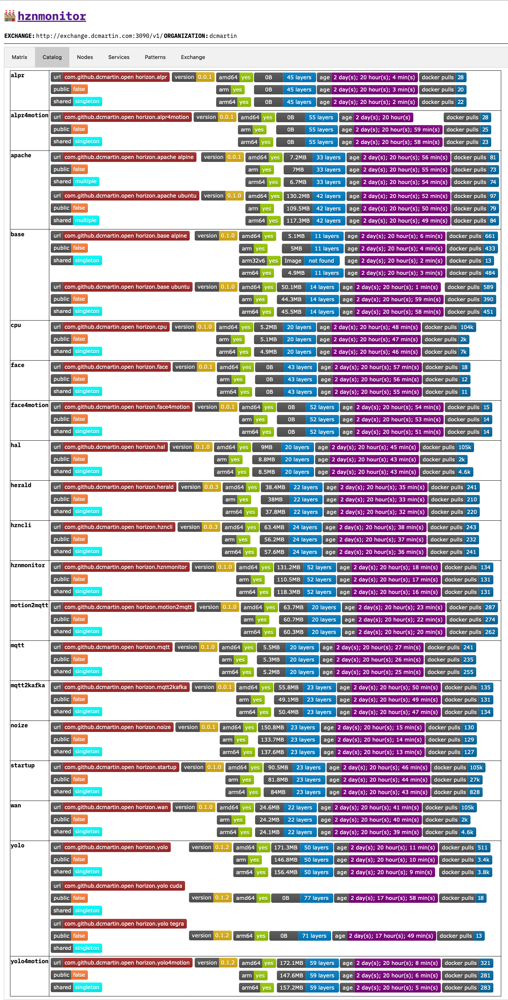

# `SETUP.md` - Setting up Open Horizon

These instructions are for Debian LINUX, notably Ubuntu and Raspbian.  Instructions for _macOS_ are TBD.

## Step 1 - Clone [repository](http://github.com/dcmartin/open-horizon)

```
mkdir ~/GIT
cd ~/GIT
git clone http://github.com/dcmartin/open-horizon
```

## Step 2 - Install  pre-requisites

### 2.1 Utilities
```
sudo apt update -qq -y && sudo apt upgrade -qq -y
sudo apt install -qq -y curl jq
```

### 2.2 `docker`
```
curl -sSL -o get.docker.sh http://get.docker.com/
chmod 755 get.docker.sh
sudo ./get.docker.sh
```

### 2.3 `/etc/docker/daemon.json`
If the host device has specialized capabilities or configuration requirements this file may require modification.  For example to enable the `nvidia` _runtime_ as the default, the `daemon.json` file would contain the following:

```
{
  "default-runtime": "nvidia",
  "runtimes": {
    "nvidia": {
      "path": "/usr/bin/nvidia-container-runtime",
      "runtimeArgs": []
    }
  }
}
```

**NOTE**: the combination of a specialized _runtime_ in conjunction with a host processor architecture is defined in the following table.

Architecture|Runtime|Label
:--|:--|:--
arm64|`nvidia`|`tegra`
amd64|`nvidia`|`cuda`
arm|`movidius`|`vino`

## Step 3 - Specify environment

### 3.1  _user_
Add the current user to the `docker` group (n.b. requires login to activate) and define associated namespace for [Docker Hub](http://hub.docker.com) access; note that `DOCKER_NAMESPACE` defaults to `USER` when undefined.

```
sudo addgroup ${USER} docker
echo ${USER} > ~/GIT/open-horizon/DOCKER_NAMESPACE
```

### 3.2 `open-horizon/`
Change directory to the top-level of this cloned repository and define the variables that control Open Horizion as follows:

+ `HZN_EXCHANGE_IP` - identifies the TCP/IPv4 network address; may be fully qualified DNS
+ `HZN_EXCHANGE_URL` _exchange_ API end-point; default: `http:${HZN_EXCHANGE_IP}:9443/css/`
+ `HZN_FSS_CSSURL` - _edge sync service_ API end-point; default: `http:${HZN_EXCHANGE_IP}:9443/css/`
+ `HZN_ORG_ID` - variable for Open Horizon CLI (_aka_ `hzn`) **and** shell scripts in this repository
+ `HZN_USER_ID` - shell scripts
+ `HZN_EXCHANGE_APIKEY` - shell scripts 
+ `HZN_EXCHANGE_USER_AUTH` -  `hzn` CLI; _aka_: `${HZN_ORD_ID}/${HZN_USER_ID}:${HZN_EXCHANGE_APIKEY}`

#### 3.2.1  _Persistent_ variables

```
cd ~/GIT/open-horizon
echo 192.168.1.199 > HZN_EXCHANGE_IP
echo http://${HZN_EXCHANGE_IP}:3090/v1/ > HZN_EXCHANGE_URL
echo http://${HZN_EXCHANGE_IP}:9443/css/ > HZN_FSS_CSSURL
echo ${USER} > HZN_ORG_ID
echo ${USER} > HZN_USER_ID
echo whocares > HZN_EXCHANGE_APIKEY
```

#### 3.2.2 _Environment_ variables

```
export HZN_EXCHANGE_APIKEY=$(cat HZN_EXCHANGE_APIKEY)
export HZN_EXCHANGE_IP=$(cat HZN_EXCHANGE_IP)
export HZN_EXCHANGE_URL=$(cat HZN_EXCHANGE_URL)
export HZN_FSS_CSSURL=$(cat HZN_FSS_CSSURL)
export HZN_ORG_ID=$(cat HZN_ORG_ID)
export HZN_USER_ID=$(cat HZN_USER_ID)
```

#### 3.2.3 Open Horizon CLI (`hzn`) variables

```
export HZN_EXCHANGE_USER_AUTH=${HZN_ORG_ID}/${HZN_USER_ID}:${HZN_EXCHANGE_APIKEY}
```

## Step 4 - Start  _exchange_
Change to the `exchange/` directory, link the `HZN_` configuration files from the parent directory, and setup the Open Horizon _exchange_; for example:

```
cd ~/GIT/open-horizon/exchange/
ln -s ../HZN* .
make config.json
make up
make prime
```

## Step 5 - Start  _agent_
Change directory to top-level of this cloned repository and run the provided script to download the Debian packages for your LINUX _flavor_ and _distribution_, e.g. `ubuntu:bionic` or `raspbian:buster`. This script will also work under _macOS_ using an alternative mechanism (n.b. see [`horizon-container`](https://github.com/open-horizon/anax/blob/bf9dea7c4a52ac952dd4a22b5134fdf8c3423550/anax-in-container/README.md) documentation); for example:

```
cd ~/GIT/open-horizon/
sudo ./sh/get.horizon.sh
```

## &#9937; Test

```
# if undefined; define now
export HZN_EXCHANGE_USER_AUTH=${HZN_ORG_ID}/${HZN_USER_ID}:${HZN_EXCHANGE_APIKEY}
hzn exchange user list
```
Outputs something like the following:

```
{
  "dcmartin/dcmartin": {
    "admin": true,
    "email": "dcmartin@dcmartin",
    "lastUpdated": "2020-04-08T23:27:18.086Z[UTC]",
    "password": "********",
    "updatedBy": "root/root"
  }
}
```

## Step 6 - Build `services/`

```
cd ~/GIT/open-horizon/services
ln -s ../HZN* .
make build
```

## Step 7 - Push _services_

```
cd ~/GIT/open-horizon/services
make push
```

## Step 8 - Publish _services_

```
cd ~/GIT/open-horizon/services
make publish
```

## &#9937; Test

```
hzn exchange service list
```

Outputs something like the following:

```
[
  "dcmartin/com.github.dcmartin.open-horizon.alpr4motion_0.0.1_amd64", "dcmartin/com.github.dcmartin.open-horizon.alpr4motion_0.0.1_arm", "dcmartin/com.github.dcmartin.open-horizon.alpr4motion_0.0.1_arm64",
  "dcmartin/com.github.dcmartin.open-horizon.alpr_0.0.1_amd64", "dcmartin/com.github.dcmartin.open-horizon.alpr_0.0.1_arm", "dcmartin/com.github.dcmartin.open-horizon.alpr_0.0.1_arm64",
  "dcmartin/com.github.dcmartin.open-horizon.apache-alpine_0.0.1_amd64", "dcmartin/com.github.dcmartin.open-horizon.apache-alpine_0.0.1_arm", "dcmartin/com.github.dcmartin.open-horizon.apache-alpine_0.0.1_arm64",
  "dcmartin/com.github.dcmartin.open-horizon.apache-ubuntu_0.1.0_amd64", "dcmartin/com.github.dcmartin.open-horizon.apache-ubuntu_0.1.0_arm", "dcmartin/com.github.dcmartin.open-horizon.apache-ubuntu_0.1.0_arm64",
  "dcmartin/com.github.dcmartin.open-horizon.base-alpine_0.1.0_amd64", "dcmartin/com.github.dcmartin.open-horizon.base-alpine_0.1.0_arm", "dcmartin/com.github.dcmartin.open-horizon.base-alpine_0.1.0_arm32v6", "dcmartin/com.github.dcmartin.open-horizon.base-alpine_0.1.0_arm64",
  "dcmartin/com.github.dcmartin.open-horizon.base-ubuntu_0.1.0_amd64", "dcmartin/com.github.dcmartin.open-horizon.base-ubuntu_0.1.0_arm", "dcmartin/com.github.dcmartin.open-horizon.base-ubuntu_0.1.0_arm64",
  "dcmartin/com.github.dcmartin.open-horizon.cpu_0.1.0_amd64", "dcmartin/com.github.dcmartin.open-horizon.cpu_0.1.0_arm", "dcmartin/com.github.dcmartin.open-horizon.cpu_0.1.0_arm64",
  "dcmartin/com.github.dcmartin.open-horizon.face4motion_0.0.1_amd64", "dcmartin/com.github.dcmartin.open-horizon.face4motion_0.0.1_arm", "dcmartin/com.github.dcmartin.open-horizon.face4motion_0.0.1_arm64",
  "dcmartin/com.github.dcmartin.open-horizon.face_0.0.1_amd64", "dcmartin/com.github.dcmartin.open-horizon.face_0.0.1_arm", "dcmartin/com.github.dcmartin.open-horizon.face_0.0.1_arm64",
  "dcmartin/com.github.dcmartin.open-horizon.hal_0.1.0_amd64", "dcmartin/com.github.dcmartin.open-horizon.hal_0.1.0_arm", "dcmartin/com.github.dcmartin.open-horizon.hal_0.1.0_arm64",
  "dcmartin/com.github.dcmartin.open-horizon.herald_0.0.3_amd64", "dcmartin/com.github.dcmartin.open-horizon.herald_0.0.3_arm", "dcmartin/com.github.dcmartin.open-horizon.herald_0.0.3_arm64",
  "dcmartin/com.github.dcmartin.open-horizon.hzncli_0.0.3_amd64", "dcmartin/com.github.dcmartin.open-horizon.hzncli_0.0.3_arm", "dcmartin/com.github.dcmartin.open-horizon.hzncli_0.0.3_arm64",
  "dcmartin/com.github.dcmartin.open-horizon.hznmonitor_0.1.0_amd64", "dcmartin/com.github.dcmartin.open-horizon.hznmonitor_0.1.0_arm", "dcmartin/com.github.dcmartin.open-horizon.hznmonitor_0.1.0_arm64",
  "dcmartin/com.github.dcmartin.open-horizon.motion2mqtt_0.1.0_amd64", "dcmartin/com.github.dcmartin.open-horizon.motion2mqtt_0.1.0_arm", "dcmartin/com.github.dcmartin.open-horizon.motion2mqtt_0.1.0_arm64",
  "dcmartin/com.github.dcmartin.open-horizon.mqtt2kafka_0.0.1_amd64", "dcmartin/com.github.dcmartin.open-horizon.mqtt2kafka_0.0.1_arm", "dcmartin/com.github.dcmartin.open-horizon.mqtt2kafka_0.0.1_arm64",
  "dcmartin/com.github.dcmartin.open-horizon.mqtt_0.1.0_amd64", "dcmartin/com.github.dcmartin.open-horizon.mqtt_0.1.0_arm", "dcmartin/com.github.dcmartin.open-horizon.mqtt_0.1.0_arm64",
  "dcmartin/com.github.dcmartin.open-horizon.noize_0.0.1_amd64", "dcmartin/com.github.dcmartin.open-horizon.noize_0.0.1_arm", "dcmartin/com.github.dcmartin.open-horizon.noize_0.0.1_arm64",
  "dcmartin/com.github.dcmartin.open-horizon.startup_0.1.0_amd64", "dcmartin/com.github.dcmartin.open-horizon.startup_0.1.0_arm", "dcmartin/com.github.dcmartin.open-horizon.startup_0.1.0_arm64",
  "dcmartin/com.github.dcmartin.open-horizon.wan_0.1.0_amd64", "dcmartin/com.github.dcmartin.open-horizon.wan_0.1.0_arm", "dcmartin/com.github.dcmartin.open-horizon.wan_0.1.0_arm64",
  "dcmartin/com.github.dcmartin.open-horizon.yolo-cuda_0.1.2_amd64",
  "dcmartin/com.github.dcmartin.open-horizon.yolo-tegra_0.1.2_arm64",
  "dcmartin/com.github.dcmartin.open-horizon.yolo4motion_0.1.2_amd64", "dcmartin/com.github.dcmartin.open-horizon.yolo4motion_0.1.2_arm", "dcmartin/com.github.dcmartin.open-horizon.yolo4motion_0.1.2_arm64",
  "dcmartin/com.github.dcmartin.open-horizon.yolo_0.1.2_amd64", "dcmartin/com.github.dcmartin.open-horizon.yolo_0.1.2_arm", "dcmartin/com.github.dcmartin.open-horizon.yolo_0.1.2_arm64"
]
```

For a complete listing of all services and their attributes, use the `lsservices.sh` script; for example:

```
cd ~/GIT/open-horizon/services
./sh/lsservices.sh
```

## Step 9 - Run `hznmonitor`  _service_
Run the `hznmonitor` service to inspect the exchange and see the listing of services in the _catalog_; for example:

```
cd ~/GIT/open-horizon/services/hznmonitor/
ln -s ../../HZN_EXCHANGE_URL HZNMONITOR_EXCHANGE_URL
ln -s ../../HZN_ORG_ID HZNMONITOR_EXCHANGE_ORG
ln -s ../../HZN_USER_ID HZNMONITOR_EXCHANGE_USER
make
```

Outputs something like the following:

```
>>> MAKE -- 13:26:54 -- build: hznmonitor; tag: dcmartin/amd64_com.github.dcmartin.open-horizon.hznmonitor:0.1.0
>>> MAKE -- 13:27:05 -- run: amd64_com.github.dcmartin.open-horizon.hznmonitor; port: 3095:3095; tag: dcmartin/amd64_com.github.dcmartin.open-horizon.hznmonitor:0.1.0
+++ WARN -- ./sh/docker-run.sh 25036 -- service port: 3095; continuing
a785cad1dac8d11ac1f12d3c40cf8fa02bda52841bd67205851a951c31582729
>>> MAKE -- 13:27:10 -- check: amd64_com.github.dcmartin.open-horizon.hznmonitor; tag: dcmartin/amd64_com.github.dcmartin.open-horizon.hznmonitor:0.1.0; URL: http://localhost:3095
```

Using a web browser navigate to the user-interface at [http://127.0.0.1:3094/](http://127.0.0.1:3094/); for example:



# Mulitple architecture

The _macOS_ Docker environment provides native support for `amd64`, `aarch64` and `armhf` architectures and may be utilized to build, push, and publish services, **but only for the standard _runtime_**.

```
cd ~/GIT/open-horizon/services
make service-build service-push service-publish
```

## CUDA and Tegra systems
Native environments for both `cuda` and `tegra` **must** be utilized to build the dependent _services_, notably the `yolo` service family and `base` container.

+ `base-cuda`
+ `base-tegra`
+ `yolo-cuda`
+ `yolo-tegra`
+ `yolo-cuda4motion`
+ `yolo-tegra4motion`

