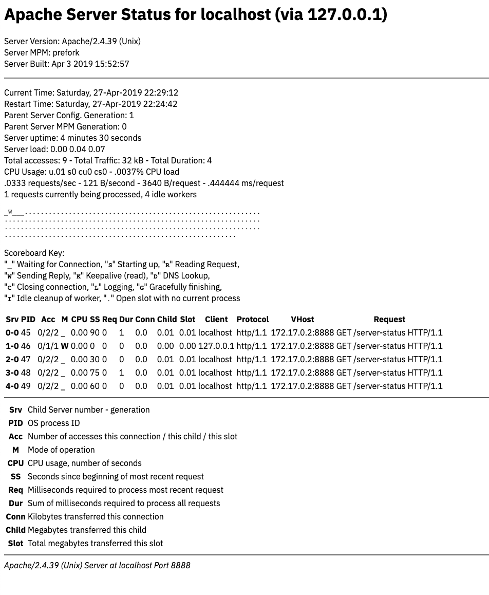

# `apache` - web server

 

Provides a base service for an [Apache](https://httpd.apache.org/) web server.  This container may be run locally using Docker, pushed to a Docker registry, and published to any [_Open Horizon_][open-horizon] exchange.

## Status

![Supports amd64 Architecture][amd64-shield]
[](https://microbadger.com/images/dcmartin/amd64_com.github.dcmartin.open-horizon.apache "Get your own image badge on microbadger.com")
[](https://microbadger.com/images/dcmartin/amd64_com.github.dcmartin.open-horizon.apache "Get your own version badge on microbadger.com")
[![Docker Pulls][pulls-amd64]][docker-amd64]

[docker-amd64]: https://hub.docker.com/r/dcmartin/amd64_com.github.dcmartin.open-horizon.apache
[pulls-amd64]: https://img.shields.io/docker/pulls/dcmartin/amd64_com.github.dcmartin.open-horizon.apache.svg

![Supports armhf Architecture][arm-shield]
[](https://microbadger.com/images/dcmartin/arm_com.github.dcmartin.open-horizon.apache "Get your own image badge on microbadger.com")
[](https://microbadger.com/images/dcmartin/arm_com.github.dcmartin.open-horizon.apache "Get your own version badge on microbadger.com")
[![Docker Pulls][pulls-arm]][docker-arm]

[docker-arm]: https://hub.docker.com/r/dcmartin/arm_com.github.dcmartin.open-horizon.apache
[pulls-arm]: https://img.shields.io/docker/pulls/dcmartin/arm_com.github.dcmartin.open-horizon.apache.svg

![Supports aarch64 Architecture][arm64-shield]
[](https://microbadger.com/images/dcmartin/arm64_com.github.dcmartin.open-horizon.apache "Get your own image badge on microbadger.com")
[](https://microbadger.com/images/dcmartin/arm64_com.github.dcmartin.open-horizon.apache "Get your own version badge on microbadger.com")
[![Docker Pulls][pulls-arm64]][docker-arm64]

[docker-arm64]: https://hub.docker.com/r/dcmartin/arm64_com.github.dcmartin.open-horizon.apache
[pulls-arm64]: https://img.shields.io/docker/pulls/dcmartin/arm64_com.github.dcmartin.open-horizon.apache.svg

[arm64-shield]: https://img.shields.io/badge/aarch64-yes-green.svg
[amd64-shield]: https://img.shields.io/badge/amd64-yes-green.svg
[arm-shield]: https://img.shields.io/badge/armhf-yes-green.svg

## Service discovery
+ `org` - `github@dcmartin.com`
+ `url` - `com.github.dcmartin.open-horizon.apache`
+ `version` - `0.0.1`

## Service ports
+ `8080` - `apache` service status; returns `application/json`
+ `8888` - Web service for HTML at `/` and CGI scripts at `/cgi-bin`

## Service variables

+ `APACHE_CONF` - location of configuration file; default: `"/etc/apache2/httpd.conf"`
+ `APACHE_HTDOCS` - location of HTML files; default: `"/var/www/localhost/htdocs"`
+ `APACHE_CGIBIN` - location of CGI scripts; default: `"/var/www/localhost/cgi-bin"`
+ `APACHE_HOST` - hostname; default: `"localhost"`
+ `APACHE_PORT` - port; default: `8888`
+ `APACHE_ADMIN` - administrative email; default: `"root@localhost
+ `LOG_LEVEL` - specify level of logging; default: `"info"`; options below
+ `DEBUG` - default: `false`

### Log levels

+ `emerg` - Emergencies - system is unusable.   
+ `alert` - Action must be taken immediately.   
+ `crit` - Critical Conditions.    
+ `error` - Error conditions.   
+ `warn` - Warning conditions.  
+ `notice` - Normal but significant condition.   
+ `info` - Informational.  
+ `debug` - Debug-level messages    
+ `trace1` - Trace messages  
+ `trace2` - Trace messages  
+ `trace3` - Trace messages  
+ `trace4` - Trace messages  
+ `trace5` - Trace messages  
+ `trace6` - Trace messages  
+ `trace7` - Trace messages, dumping large amounts of data   
+ `trace8` - Trace messages, dumping large amounts of data

## Description
Provide Apache2 HTTP Web server for HTML pages and CGI scripts with ExtendedStatus enabled (*local* only).

### HTML pages
Pages may be changed in the `rootfs/var/www/localhost/htdocs/` directory.  The default `index.html` provides a listing of the service environment variables, for example at `http://localhost:8888/`:


### CGI scripts
Scripts may be changed in the `rootfs/var/www/localhost/cgi-bin/` directory.  There is one sample CGI application, `test`, which provides that information as JSON; for example:

```
% curl localhost:8888/cgi-bin/test
```

```
{
  "host": "4366e337e4bb",
  "env": [
    { "key": "HTTP_HOST", "value": "localhost:8888" },
    { "key": "CONTEXT_DOCUMENT_ROOT", "value": "/var/www/localhost/cgi-bin/" },
    { "key": "HTTP_USER_AGENT", "value": "curl/7.54.0" },
    { "key": "SERVER_ADMIN", "value": "root@localhost.local" },
    { "key": "CONTEXT_PREFIX", "value": "/cgi-bin/" },
    { "key": "SERVER_PORT", "value": "8888" },
    { "key": "SERVER_NAME", "value": "localhost" },
    { "key": "QUERY_STRING", "value": "" },
    { "key": "SCRIPT_FILENAME", "value": "/var/www/localhost/cgi-bin/test" },
    { "key": "PWD", "value": "/var/www/localhost/cgi-bin" },
    { "key": "HTTP_ACCEPT", "value": "*/*" },
    { "key": "HZN", "value": "{date:1556404265,hzn:{agreementid:,arch:,cpus:0,device_id:,exchange_url:,host_ips:[],organization:,ram:0,pattern:null}}" },
    { "key": "REQUEST_METHOD", "value": "GET" },
    { "key": "SERVER_SIGNATURE", "value": "<address>Apache/2.4.39 (Unix) Server at localhost Port 8888</address>" },
    { "key": "", "value": "" },
    { "key": "SCRIPT_NAME", "value": "/cgi-bin/test" },
    { "key": "REMOTE_PORT", "value": "49444" },
    { "key": "DOCUMENT_ROOT", "value": "/var/www/localhost/htdocs" },
    { "key": "SHLVL", "value": "1" },
    { "key": "SERVER_PROTOCOL", "value": "HTTP/1.1" },
    { "key": "REQUEST_URI", "value": "/cgi-bin/test" },
    { "key": "PATH", "value": "/usr/local/sbin:/usr/local/bin:/usr/sbin:/usr/bin:/sbin:/bin" },
    { "key": "SERVER_ADDR", "value": "172.17.0.2" },
    { "key": "GATEWAY_INTERFACE", "value": "CGI/1.1" },
    { "key": "REQUEST_SCHEME", "value": "http" },
    { "key": "REMOTE_ADDR", "value": "172.17.0.1" },
    { "key": "SERVER_SOFTWARE", "value": "Apache/2.4.39 (Unix)" },
    { "key": "_", "value": "/usr/bin/env" }
  ]
}
```

## How To Use
Copy this [repository][repository], change to the `apache` directory, then use the **make** command; see below:

```
% mkdir ~/gitdir
% cd ~/gitdir
% git clone http://github.com/dcmartin/open-horizon
% cd open-horizon/apache
% make
...
```

Once the service has been `built`, `run`, and `check` the first time, subsequent `check` will yield status output include the Apache server `status` HTML page, *base64* encoded.

```
% make check
```

```
{
  "apache": {
    "pid": 37,
    "status": "PCFET0NUWVBFIEhUTUwgUFVCTElDICItLy9XM0MvL0RURCBIVE1MIDMuMiBGaW5hbC8vRU4iPgo8aHRtbD48aGVhZD4KPHRpdGxlPkFwYWNoZSBTdGF0dXM8L3RpdGxlPgo8L2hlYWQ+PGJvZHk+CjxoMT5BcGFjaGUgU2VydmVyIFN0YXR1cyBmb3IgbG9jYWxob3N0ICh2aWEgMTI3LjAuMC4xKTwvaDE+Cgo8ZGw+PGR0PlNlcnZlciBWZXJzaW9uOiBBcGFjaGUvMi40LjM5IChVbml4KTwvZHQ+CjxkdD5TZXJ2ZXIgTVBNOiBwcmVmb3JrPC9kdD4KPGR0PlNlcnZlciBCdWlsdDogQXByICAzIDIwMTkgMTU6NTI6NTcKPC9kdD48L2RsPjxociAvPjxkbD4KPGR0PkN1cnJlbnQgVGltZTogU2F0dXJkYXksIDI3LUFwci0yMDE5IDIyOjMxOjA1IDwvZHQ+CjxkdD5SZXN0YXJ0IFRpbWU6IFNhdHVyZGF5LCAyNy1BcHItMjAxOSAyMjozMTowNSA8L2R0Pgo8ZHQ+UGFyZW50IFNlcnZlciBDb25maWcuIEdlbmVyYXRpb246IDE8L2R0Pgo8ZHQ+UGFyZW50IFNlcnZlciBNUE0gR2VuZXJhdGlvbjogMDwvZHQ+CjxkdD5TZXJ2ZXIgdXB0aW1lOiA8L2R0Pgo8ZHQ+U2VydmVyIGxvYWQ6IDAuMTQgMC4wNiAwLjA3PC9kdD4KPGR0PlRvdGFsIGFjY2Vzc2VzOiAwIC0gVG90YWwgVHJhZmZpYzogMCBrQiAtIFRvdGFsIER1cmF0aW9uOiAwPC9kdD4KPGR0PkNQVSBVc2FnZTogdTAgczAgY3UwIGNzMDwvZHQ+CjxkdD48L2R0Pgo8ZHQ+MSByZXF1ZXN0cyBjdXJyZW50bHkgYmVpbmcgcHJvY2Vzc2VkLCAzIGlkbGUgd29ya2VyczwvZHQ+CjwvZGw+PHByZT5fX1dfUy4uLi4uLi4uLi4uLi4uLi4uLi4uLi4uLi4uLi4uLi4uLi4uLi4uLi4uLi4uLi4uLi4uLi4uLi4uLi4uCi4uLi4uLi4uLi4uLi4uLi4uLi4uLi4uLi4uLi4uLi4uLi4uLi4uLi4uLi4uLi4uLi4uLi4uLi4uLi4uLi4uLi4KLi4uLi4uLi4uLi4uLi4uLi4uLi4uLi4uLi4uLi4uLi4uLi4uLi4uLi4uLi4uLi4uLi4uLi4uLi4uLi4uLi4uLgouLi4uLi4uLi4uLi4uLi4uLi4uLi4uLi4uLi4uLi4uLi4uLi4uLi4uLi4uLi4uLi4uLi4uLi4uLi4uPC9wcmU+CjxwPlNjb3JlYm9hcmQgS2V5OjxiciAvPgoiPGI+PGNvZGU+XzwvY29kZT48L2I+IiBXYWl0aW5nIGZvciBDb25uZWN0aW9uLCAKIjxiPjxjb2RlPlM8L2NvZGU+PC9iPiIgU3RhcnRpbmcgdXAsIAoiPGI+PGNvZGU+UjwvY29kZT48L2I+IiBSZWFkaW5nIFJlcXVlc3QsPGJyIC8+CiI8Yj48Y29kZT5XPC9jb2RlPjwvYj4iIFNlbmRpbmcgUmVwbHksIAoiPGI+PGNvZGU+SzwvY29kZT48L2I+IiBLZWVwYWxpdmUgKHJlYWQpLCAKIjxiPjxjb2RlPkQ8L2NvZGU+PC9iPiIgRE5TIExvb2t1cCw8YnIgLz4KIjxiPjxjb2RlPkM8L2NvZGU+PC9iPiIgQ2xvc2luZyBjb25uZWN0aW9uLCAKIjxiPjxjb2RlPkw8L2NvZGU+PC9iPiIgTG9nZ2luZywgCiI8Yj48Y29kZT5HPC9jb2RlPjwvYj4iIEdyYWNlZnVsbHkgZmluaXNoaW5nLDxiciAvPiAKIjxiPjxjb2RlPkk8L2NvZGU+PC9iPiIgSWRsZSBjbGVhbnVwIG9mIHdvcmtlciwgCiI8Yj48Y29kZT4uPC9jb2RlPjwvYj4iIE9wZW4gc2xvdCB3aXRoIG5vIGN1cnJlbnQgcHJvY2VzczxiciAvPgo8L3A+CgoKPHRhYmxlIGJvcmRlcj0iMCI+PHRyPjx0aD5TcnY8L3RoPjx0aD5QSUQ8L3RoPjx0aD5BY2M8L3RoPjx0aD5NPC90aD48dGg+Q1BVCjwvdGg+PHRoPlNTPC90aD48dGg+UmVxPC90aD48dGg+RHVyPC90aD48dGg+Q29ubjwvdGg+PHRoPkNoaWxkPC90aD48dGg+U2xvdDwvdGg+PHRoPkNsaWVudDwvdGg+PHRoPlByb3RvY29sPC90aD48dGg+Vkhvc3Q8L3RoPjx0aD5SZXF1ZXN0PC90aD48L3RyPgoKPHRyPjx0ZD48Yj4yLTA8L2I+PC90ZD48dGQ+NDU8L3RkPjx0ZD4wLzAvMDwvdGQ+PHRkPjxiPlc8L2I+CjwvdGQ+PHRkPjAuMDA8L3RkPjx0ZD4wPC90ZD48dGQ+MDwvdGQ+PHRkPjA8L3RkPjx0ZD4wLjA8L3RkPjx0ZD4wLjAwPC90ZD48dGQ+MC4wMAo8L3RkPjx0ZD4xMjcuMC4wLjE8L3RkPjx0ZD5odHRwLzEuMTwvdGQ+PHRkIG5vd3JhcD4xNzIuMTcuMC4yOjg4ODg8L3RkPjx0ZCBub3dyYXA+R0VUIC9zZXJ2ZXItc3RhdHVzIEhUVFAvMS4xPC90ZD48L3RyPgoKPHRyPjx0ZD48Yj40LTA8L2I+PC90ZD48dGQ+NDc8L3RkPjx0ZD4wLzAvMDwvdGQ+PHRkPjxiPlM8L2I+CjwvdGQ+PHRkPjAuMDA8L3RkPjx0ZD4xNTU2NDA0MjY1PC90ZD48dGQ+MDwvdGQ+PHRkPjA8L3RkPjx0ZD4wLjA8L3RkPjx0ZD4wLjAwPC90ZD48dGQ+MC4wMAo8L3RkPjx0ZD48L3RkPjx0ZD48L3RkPjx0ZCBub3dyYXA+PC90ZD48dGQgbm93cmFwPjwvdGQ+PC90cj4KCjwvdGFibGU+CiA8aHIgLz4gPHRhYmxlPgogPHRyPjx0aD5TcnY8L3RoPjx0ZD5DaGlsZCBTZXJ2ZXIgbnVtYmVyIC0gZ2VuZXJhdGlvbjwvdGQ+PC90cj4KIDx0cj48dGg+UElEPC90aD48dGQ+T1MgcHJvY2VzcyBJRDwvdGQ+PC90cj4KIDx0cj48dGg+QWNjPC90aD48dGQ+TnVtYmVyIG9mIGFjY2Vzc2VzIHRoaXMgY29ubmVjdGlvbiAvIHRoaXMgY2hpbGQgLyB0aGlzIHNsb3Q8L3RkPjwvdHI+CiA8dHI+PHRoPk08L3RoPjx0ZD5Nb2RlIG9mIG9wZXJhdGlvbjwvdGQ+PC90cj4KPHRyPjx0aD5DUFU8L3RoPjx0ZD5DUFUgdXNhZ2UsIG51bWJlciBvZiBzZWNvbmRzPC90ZD48L3RyPgo8dHI+PHRoPlNTPC90aD48dGQ+U2Vjb25kcyBzaW5jZSBiZWdpbm5pbmcgb2YgbW9zdCByZWNlbnQgcmVxdWVzdDwvdGQ+PC90cj4KIDx0cj48dGg+UmVxPC90aD48dGQ+TWlsbGlzZWNvbmRzIHJlcXVpcmVkIHRvIHByb2Nlc3MgbW9zdCByZWNlbnQgcmVxdWVzdDwvdGQ+PC90cj4KIDx0cj48dGg+RHVyPC90aD48dGQ+U3VtIG9mIG1pbGxpc2Vjb25kcyByZXF1aXJlZCB0byBwcm9jZXNzIGFsbCByZXF1ZXN0czwvdGQ+PC90cj4KIDx0cj48dGg+Q29ubjwvdGg+PHRkPktpbG9ieXRlcyB0cmFuc2ZlcnJlZCB0aGlzIGNvbm5lY3Rpb248L3RkPjwvdHI+CiA8dHI+PHRoPkNoaWxkPC90aD48dGQ+TWVnYWJ5dGVzIHRyYW5zZmVycmVkIHRoaXMgY2hpbGQ8L3RkPjwvdHI+CiA8dHI+PHRoPlNsb3Q8L3RoPjx0ZD5Ub3RhbCBtZWdhYnl0ZXMgdHJhbnNmZXJyZWQgdGhpcyBzbG90PC90ZD48L3RyPgogPC90YWJsZT4KPGhyIC8+CjxhZGRyZXNzPkFwYWNoZS8yLjQuMzkgKFVuaXgpIFNlcnZlciBhdCBsb2NhbGhvc3QgUG9ydCA4ODg4PC9hZGRyZXNzPgo8L2JvZHk+PC9odG1sPgo="
  },
  "date": 1556404265,
  "hzn": {
    "agreementid": "",
    "arch": "",
    "cpus": 0,
    "device_id": "",
    "exchange_url": "",
    "host_ips": [
      ""
    ],
    "organization": "",
    "ram": 0,
    "pattern": null
  },
  "config": {
    "conf": "/etc/apache2/httpd.conf",
    "htdocs": "/var/www/localhost/htdocs",
    "cgibin": "/var/www/localhost/cgi-bin",
    "host": "localhost",
    "port": "8888",
    "admin": "root@localhost.local",
    "pidfile": "/var/run/apache2.pid",
    "rundir": "/var/run/apache2"
  },
  "service": {
    "label": "apache",
    "version": "0.0.1"
  }
}
```

### EXAMPLE `status`
The Apache2 Web server status information may be extracted from the status JSON payload, for example:

```
% curl localhost:8080 | jq -r '.apache.status' | base64 --decode > status.html
```



## Changelog & Releases

Releases are based on Semantic Versioning, and use the format
of ``MAJOR.MINOR.PATCH``. In a nutshell, the version will be incremented
based on the following:

- ``MAJOR``: Incompatible or major changes.
- ``MINOR``: Backwards-compatible new features and enhancements.
- ``PATCH``: Backwards-compatible bugfixes and package updates.

## Authors & contributors

[David C Martin][dcmartin] (github@dcmartin.com)

[dcmartin]: https://github.com/dcmartin
[edge-fabric]: https://console.test.cloud.ibm.com/docs/services/edge-fabric/getting-started.html
[edge-install]: https://console.test.cloud.ibm.com/docs/services/edge-fabric/adding-devices.html
[edge-slack]: https://ibm-appsci.slack.com/messages/edge-fabric-users/
[ibm-apikeys]: https://console.bluemix.net/iam/#/apikeys
[ibm-registration]: https://console.bluemix.net/registration/
[issue]: https://github.com/dcmartin/open-horizon/issues
[macos-install]: http://pkg.bluehorizon.network/macos
[open-horizon]: http://github.com/open-horizon/
[repository]: https://github.com/dcmartin/open-horizon
[setup]: ../setup/README.md
