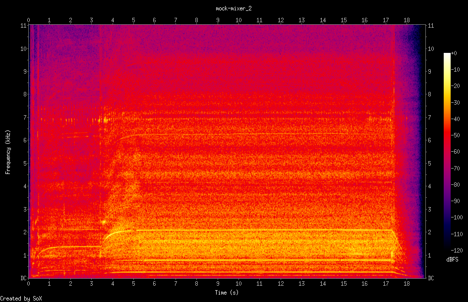

# &#127897; `noize` - detect sound and send to MQTT

Monitors attached microphone and provides [`sox`](https://linux.die.net/man/1/sox) functionality as micro-service, transmitting WAV data and spectrogram visualization (PNG) a designated [MQTT][mqtt-org] host.  This container may be run locally using Docker, pushed to a Docker registry, and published to any [_Open Horizon_][open-horizon] exchange.

[mqtt-org]: http://mqtt.org/
[motion-project-io]: https://motion-project.github.io/

## Status

![Supports amd64 Architecture][amd64-shield]
[](https://microbadger.com/images/dcmartin/amd64_noize "Get your own image badge on microbadger.com")
[](https://microbadger.com/images/dcmartin/amd64_noize "Get your own version badge on microbadger.com")
[![Docker Pulls][pulls-amd64]][docker-amd64]

[docker-amd64]: https://hub.docker.com/r/dcmartin/amd64_noize
[pulls-amd64]: https://img.shields.io/docker/pulls/dcmartin/amd64_noize.svg

![Supports arm Architecture][arm-shield]
[](https://microbadger.com/images/dcmartin/arm_noize "Get your own image badge on microbadger.com")
[](https://microbadger.com/images/dcmartin/arm_noize "Get your own version badge on microbadger.com")
[![Docker Pulls][pulls-arm]][docker-arm]

[docker-arm]: https://hub.docker.com/r/dcmartin/arm_noize
[pulls-arm]: https://img.shields.io/docker/pulls/dcmartin/arm_noize.svg

![Supports arm64 Architecture][arm64-shield]
[](https://microbadger.com/images/dcmartin/arm64_noize "Get your own image badge on microbadger.com")
[](https://microbadger.com/images/dcmartin/arm64_noize "Get your own version badge on microbadger.com")
[![Docker Pulls][pulls-arm64]][docker-arm64]

[docker-arm64]: https://hub.docker.com/r/dcmartin/arm64_noize
[pulls-arm64]: https://img.shields.io/docker/pulls/dcmartin/arm64_noize.svg

[arm64-shield]: https://img.shields.io/badge/arm64-yes-green.svg
[amd64-shield]: https://img.shields.io/badge/amd64-yes-green.svg
[arm-shield]: https://img.shields.io/badge/arm-yes-green.svg

## Service discovery
+ `org` - `github@dcmartin.com`
+ `url` - `noize`
+ `version` - `0.0.1`

## Service variables
+ `NOIZE_GROUP` - group name (aka top-level topic); defaults to `noize`
+ `NOIZE_CLIENT` - client name; defaults to `HZN_DEVICE_ID` or `hostname`
+ `NOIZE_DEVICE` - device to record sound; default: *system default device*
+ `NOIZE_START_LEVEL` - default: `1` percent
+ `NOIZE_START_SECONDS` - default: `0.1` seconds
+ `NOIZE_TRIM_DURATION` - default: `5` seconds
+ `NOIZE_THRESHOLD_TUNE` - default: `false`
+ `NOIZE_INCLUDE_WAV` - include audio as base64 encoded WAV; default: `true`
+ `NOIZE_INCLUDE_PNG` - include spectrogram as base64 encoded PNG; default: `true`
+ `NOIZE_THRESHOLD` - default: `none`; specify KHz
+ `NOIZE_LEVEL_TUNE` - default: `false`
+ `LOGTO` - specify place to log; default: `"/dev/stderr"`; use `""` for `${TMPDIR}/${0##*/}.log`
+ `LOG_LEVEL` - specify level of logging; default `info`; options include (`debug` and `none`; currently ignored)
+ `DEBUG` - default: `false`

## Required Services

### [`mqtt`](../mqtt/README.md)
+ `MQTT_PORT` - port number; defaults to `1883`
+ `MQTT_USERNAME` - MQTT username; defaults to ""
+ `MQTT_PASSWORD` - MQTT password; defaults to ""

## How To Use
Copy this [repository][repository], change to the `noize` directory, then use the **make** command; see below:

```
% mkdir ~/gitdir
% cd ~/gitdir
% git clone http://github.com/dcmartin/open-horizon
% cd open-horizon.noize
% make
...
```

The `noize` value will initially be incomplete until the service completes its initial execution.  Subsequent tests should return a completed payload, see below:

```
% make check
```

should result in a partial service payload:

```
{
  "mqtt": null,
  "noize": {
    "date": 1555859075,
    "client": "b95ffa22f971",
    "mock": "square",
    "noise": "<base64 encoded WAV>",
    "spectrogram": "<base64 encoded PNG>"
  },
  "date": 1555859040,
  "hzn": {
    "agreementid": "",
    "arch": "",
    "cpus": 0,
    "device_id": "",
    "exchange_url": "",
    "host_ips": [
      ""
    ],
    "organization": "",
    "ram": 0,
    "pattern": null
  },
  "config": {
    "tmpdir": "/tmpfs",
    "logto": "/dev/stderr",
    "log_level": "info",
    "debug": true,
    "group": "noize",
    "client": "b95ffa22f971",
    "start": {
      "level": 1,
      "seconds": 0.1
    },
    "trim": {
      "duration": 5
    },
    "sample_rate": "19200",
    "threshold": "none",
    "threshold_tune": false,
    "level_tune": false,
    "services": [
      {
        "name": "mqtt",
        "url": "http://mqtt"
      }
    ]
  },
  "service": {
    "label": "noize",
    "version": "0.0.1"
  }
}
```

**EXAMPLE**


<audio src="samples/example.wav">

## Changelog & Releases

Releases are based on Semantic Versioning, and use the format
of ``MAJOR.MINOR.PATCH``. In a nutshell, the version will be incremented
based on the following:

- ``MAJOR``: Incompatible or major changes.
- ``MINOR``: Backwards-compatible new features and enhancements.
- ``PATCH``: Backwards-compatible bugfixes and package updates.

## Authors & contributors

[David C Martin][dcmartin] (github@dcmartin.com)

[userinput]: ../noize/userinput.json
[service-json]: ../noize/service.json
[build-json]: ../noize/build.json
[dockerfile]: ../noize/Dockerfile


[dcmartin]: https://github.com/dcmartin
[issue]: https://github.com/dcmartin/open-horizon/issues
[macos-install]: http://pkg.bluehorizon.network/macos
[open-horizon]: http://github.com/open-horizon/
[repository]: https://github.com/dcmartin/open-horizon
[setup]: ../setup/README.md
